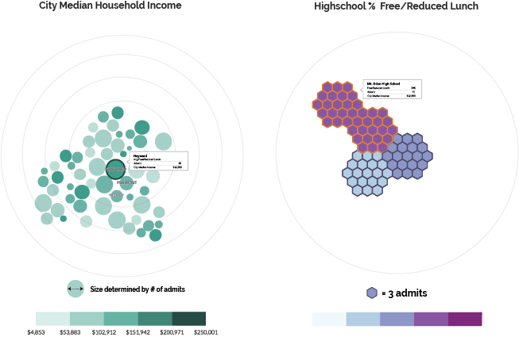

# Income Distribution of UC Admits
Authors: Jay Mahabal, Manisha Sharma, Varsha Venkat

#### Question
Are students from high schools in a higher income bracket more likely to apply to the UCs?

####Datasets:
- [City Median Household Income](http://censusreporter.org/data/table/?table=B19013&geo_ids=04000US06,160|04000US06&primary_geo_id=04000US06)
- [UC Admission for California Public High Schools](http://universityofcalifornia.edu/infocenter/admissions-source-school)
- [% Free/Reduced Lunch for Public High School](put link here)

#### Mockup #1

**`Layer 1`**: Each bubble's size is determined by the # of admits while the color is determined by the city median household income.

**`Layer 2`**: Each highschool in each city with the color determined by the % of free an reduced lunch. Each hexagonal unit represents 3 admits.

